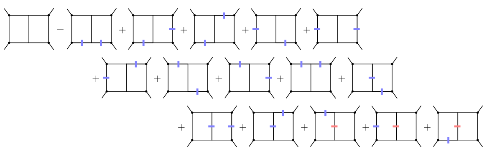
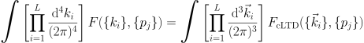
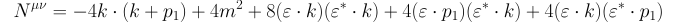

#
# cLTD - Causal Loop-Tree Duality
**Authors**: Z. Capatti, V. Hirschi, D. Kermanschah, A. Pelloni, B. Ruijl


# Table of Contents
1. [Introduction](#introduction)
2. [Dependencies](#dependencies)
4. [Usage](#usage)
    1. [Import](#import)
    2. [Options](#options)
    2. [Input format](#input)
    2. [Output format](#output)
4. [Example](#example)
    1. [Scalar integral: Double Box](#exampleDoubleBox)
    2. [Raised power propagators: Triangle](#exampleTriangle)
    3. [**Numerators**](#numerator)
5. [Reference](#reference)


## Introduction
The integration of a `n`-loop Feynman diagram requires the integrating over `4*n` dimensions.
By means of the Loop-Tree duality, it's possible to bring down this integration to only `3*n` spatial dimensions. 

This new representation consists of the sum over all possible spanning tree of the original diagram. One of the major problems that one can encounter is that these terms will introduce a number of spurious singularities that could lead to a poor numerical integration convergence.

Here we present a **Mathmatica Package** with the implementation of the algorithm presented in the paper [Manifestly Causal Loop-Tree Duality](https://arxiv.org/abs/2009.05509), where it was already implemented into a python script.

The master formula reads:



## Dependencies
* **Mathematica**: tested on Mathematica 12.0 and higher.
* **FORM**: can be downloaded from [here](https://github.com/vermaseren/form/releases).

## Usage

### Import
This package represents a Mathematica frontend and requires a working installation of [FORM](https://github.com/vermaseren/form/releases) in order to run successfully.
If the cLTD folder is added to the libraries in Mathematica, one can import it with:
```Mathematica
<< cLTD`
```
or by defining the location of the package:
```Mathematica
Get["<path-to-package-folder>/cLTD.m"]
```
or alternatively directly from github:
```mathematica
Import["https://github.com/apelloni/cLTD/raw/main/cLTD.m"]
SetOptions[cLTD, WorkingDirectory -> "./"]
```


### Options

There are several options that can be set when calling the `cLTD` function. The default values are:
```Mathematica 
In[1]:= Options[cLTD]
Out[1]= {"loopmom" -> {k0, k1, k2, k3}, 
         "FORMpath" -> "form", 
         "WorkingDirectory" -> NotebookDirectory[], 
         "FORM_ID" -> None,
         "keep_FORM_script" -> False, 
         "EvalAll" -> False}
```

Their usage is as follows:

* `loopmom`: defines the variables that need to be considered loop momenta in the evaluated expression

* `"FORMpath"`: By default, it assumes that the path to `form` is included in `$PATH`. If this is not the case, one can set this option to the required path.
This must be either a absolute or relative path (no `~`):
```Mathematica
SetOptions[cLTD, "FORM_path" -> "/home/dude/dir1/dir2/bin/form"]
```

* `WorkingDirectory`: FORM will need to create some temporary files in order to process the expression. By default, this happens in the same folder as the current Mathematica notebook.

* `"FORM_ID"` and `"keep_FORM_script"`: the temporary file generate by the program have the name `cLTD_<FORM_ID>.frm` and `cLTD_<FORM_ID>.out`.
By default, the `FORM_ID` is filled with a series of random characters in order to avoid possible conflicts with pre-existing files.
As soon as the `cLTD` call retrieves the output from FORM it deletes these files.
It may happen that you want to keep the script and also give it a more precise name.
One way to do it is:
```Mathematica
SetOptions[cLTD, "FORM_ID" -> 1]
SetOptions[cLTD, "keep_FORM_script" -> True]
```

* `EvalAll`: It substitute the `LTDnorm` and `den` functions.

### Input

The input must contain the **propagator** in the form:
 - `prop[momentum, mass]`

One can multiply several such propagators to build its own topology. One such use can be found in the [double-box example](#exampleDoubleBox), or even sum several topologies together. In the latter case, they all need to contain the same amount of loops.

The **numerator** can be expressed by means of one helper function:
 - `Dot[p1,p2]` or `p1.p2`: Euclidean scalar product of the spatial component of two momenta
 - `SP4[p1,p2]`: representation of the 4-dimensional scalar product between two momenta `p1` and `p2` using the metric `(1,-1,-1,-1)`.
 

In case it's not possible to express the numerator in terms of scalar products, one can always write it as an energy polynomial.

Some examples of valid numerator inputs (`k,l`: loop momenta, `p1,p2`: external momenta)
```mathematica
(*Unity*)
num0 = 1;
(*Using scalar products*)
num1 = SP4[p1,k]+SP4[p2,k]+SP4[k,l];
(*Energy polynomial*)
num2 = k[0]*c1+l[0]*c2+k[0]*l[0]*c3+p1[0]*p2[0];
(*Mixed*)
num3 = k[0]*SP4[p1,l] + p2.l;
num4 = k[0] p[0] - k.p (*Equivalent to SP4[k,p]*)
```

Note that only the energy components of the loop momenta are actively involved during the evaluation of the residue.

### Output
The output contains:
 - `cLTDnorm[expr]`: normalization factor, it correponds to `1/expr`.
 - `den[expr]`: denominators, can be evaluated as `1/expr`.
 - `p.q`: Euclidean scalar product of the spatial component of two momenta
 - `p[0]`: energy component of momentum `p`


## Example

### Scalar integral: Double Box <a name="exampleDoubleBox"></a>
For scalar propagators, one should use the helper function `prop[mom, mass]` in order to define the propagators that are present in the diagram:
```Mathematica
(* Get cLTD and define path to FORM *)
<< cLTD`
SetOptions[cLTD, "FORM_path" -> "/home/dude/dir1/dir2/bin/form"];

(* Doube box *)
expr = prop[k, 0] * prop[k-p1, 0] * prop[k+p2, 0] * prop[k-l,0]\
     * prop[l+p2, 0] * prop[l+p2+p3, 0] * prop[l-p1, 0];

(* Get the cLTD expression *)
cDoubleBox = cLTD[expr, loopmom -> {k,l}];      
```
In order to numerically integrate the expression above in the remaining 6 dimensions, one will need to regulate the IR divergences.

It is always possible to consider a massive box:
```Mathematica
(* Massive Doube box *)
expr = prop[k, m] * prop[k-p1, m] * prop[k+p2, m] * prop[k-l,0]\
     * prop[l+p2, m] * prop[l+p2+p3, m] * prop[l-p1, m];
```

### Raised power propagators: Triangle <a name="exampleTriangle"></a>
The code also allows for raised powers in the propagators. 
For the case of a triangle with off-shell externals, one will need to regulate the UV divergences in order to obtain a finite integral:

```Mathematica
(* Get cLTD and define path to FORM *)
<< cLTD`
SetOptions[cLTD, "FORM_path" -> "/home/dude/dir1/dir2/bin/form"];

(* TriangleBox - UV CT *)
expr = prop[k, 0] * prop[k-p1, 0] * prop[k+p2, 0] - prop[k, mUV]^3;

(* Get the cLTD expression *)
cTriangleUV = cLTD[expr, loopmom -> {k}];      
```

### Numerators
The code also supports numerators. 

One can include **Minkowki scalar products** by using `SP4[mom1,mom2]` in the expression.

For the one-loop photon self energy, the numerator takes the form:



Which can be expressed as: 
```mathematica
(* One-loop photon self energy *)
numerator = - 4 * SP4[k,p1] + 4 * m^2 \
            + 8 * SP4[pol,k] * SP4[cpol,k]\
            + 4 * SP4[pol,p1] * SP4[cpol,k]\
            + 4 * SP4[pol,k] * SP4[cpol,p1];
props = prop[k,m] * prop[k+p1,m];

(* Get the cLTD expression *)
cPhotonSelf = cLTD[numerator * props, loopmom -> {k}];      

```

It could be that the numerator cannot be written in terms of scalar products; in this case, one should write the numerator as a polynomial in the loop momenta's energy components.


## Reference 
If you use this program, please cite the corresponding work on which the procedure is based on:

> Z. Capatti, V. Hirschi, D. Kermanschah, A. Pelloni, B. Ruijl, Manifestly Causal Loop-Tree Duality. arXiv: 2009.05509 [hep-ph] (Sept. 2020)
